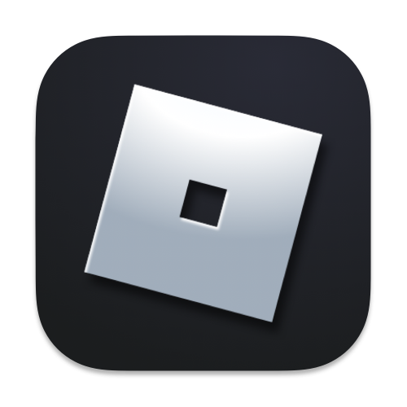

  

  <h3>Copy Roblox Games</h3>

  

 

## 📖 About

**Bloxwin** is a browser extension created for educational and research purposes. It allows users to observe and understand how certain randomization mechanisms in browser-based games work by analyzing public data sources and user interactions.

## 🔧 Installation

1. **Download** the HTRG release.
2. **Extract** the ZIP archive.
3. Open Chrome and go to `chrome://extensions/`
4. Enable **Developer mode**
5. Click **"Load unpacked"** and select the extracted folder.

## 🧪 Usage

1. Open the **Extensions menu** in Chrome and activate **Copy Roblox Games**.

3. If prompted, you may enter a session key for accessing specific features.  
   - Contact the developer if needed.

> ⚠️ This tool is intended for **educational** and **analytical** use only. It does not modify gameplay or interact directly with game servers.

## 📜 License

Distributed under the MIT License. See [LICENSE](/LICENSE) for details.
